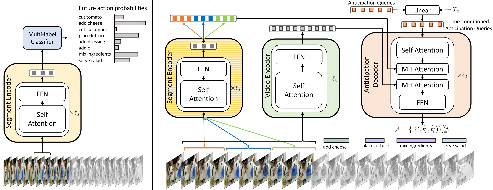

# ANTICIPATR

This repository contains the codebase for Anticipation Transformer (Anticipatr) proposed in the [ECCV'22 paper](https://meghanawhal.github.io/projects/anticipatr/resources/nawhal_eccv22.pdf).

---

## Model

<div align='center'>
  
</div>

---

## Getting started

Our method proposes a two-stage training method for the task of long-term action anticipation.

- `pretraining` directory contains code for stage 1. This stage involves training a model for the task of snippet-based action anticipation.
- `src` directory contains code for stage 2. This stage uses the frozen networks from stage 1 and trains two other networks for the task of long-term action anticipation.

- The file `env.yml` provides dependencies for the training environment

- To train the model, download the features to the path given in the
<dataset>.py file or change the path to a custom location.

For our training setup, we use these directories.

- `pretraining_data` provides the data specific to our training for stage 1.
- For our implementation, we save data in a directory `data` within this
  top-level directory. For training the data needs to be downloaded from cited sources.
   - The features and annotations for Epic-Kitchens-55 and EGTEA can be downloaded from
   https://github.com/facebookresearch/ego-topo
   - The features and annotations for Breakfast can be downloaded from
   https://github.com/yabufarha/ms-tcn


- We also add sample run scripts for the codes in the directory `run_scripts`

---

## Citation

```
@inproceedings{nawhal2022anticipatr,
  title={Rethinking Learning Approaches for Long-Term Action Anticipation},
  author={Nawhal, Megha and Jyothi, Akash Abdu and Mori, Greg},
  booktitle={Proceedings of the European Conference on Computer Vision},
  year={2022}
}
```

---


## Contact

For further questions, please email [Megha Nawhal](http://meghanawhal.github.io).
